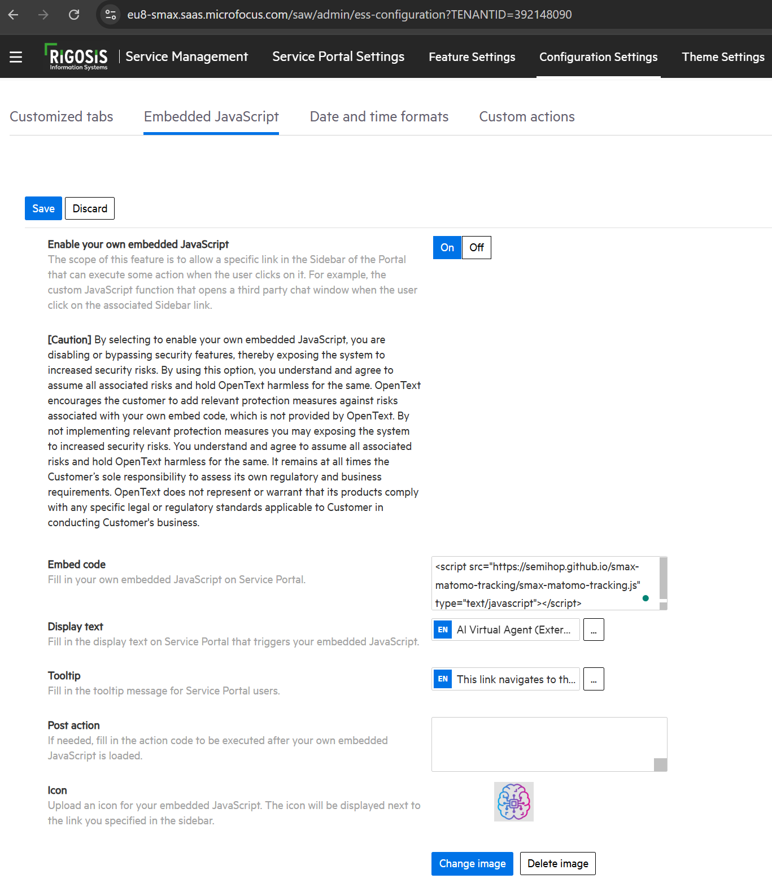
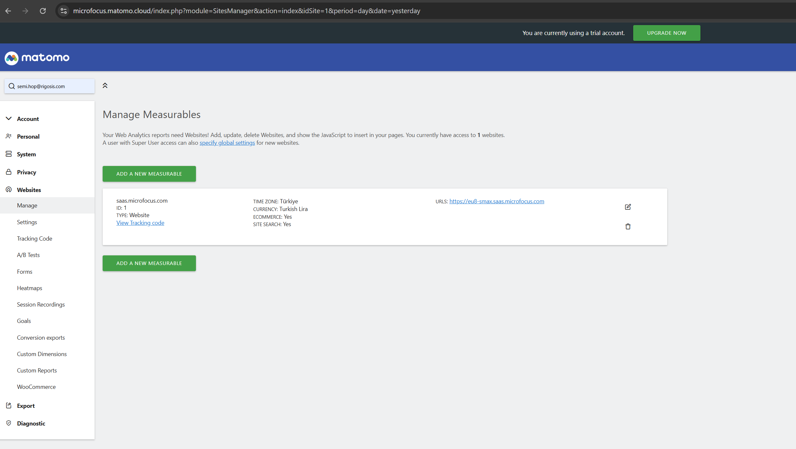
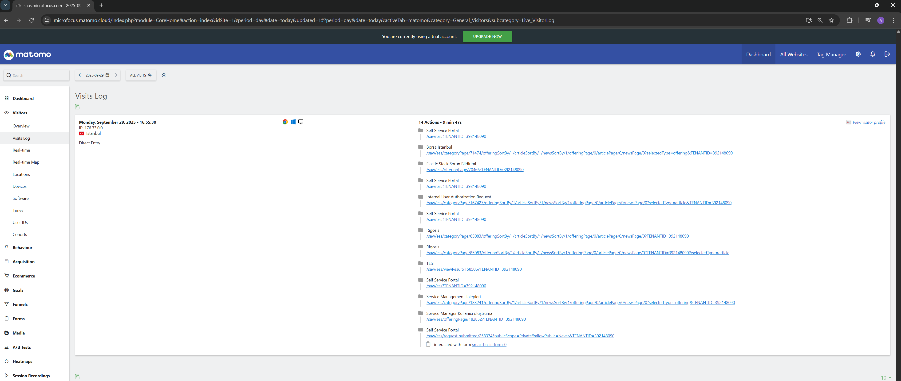
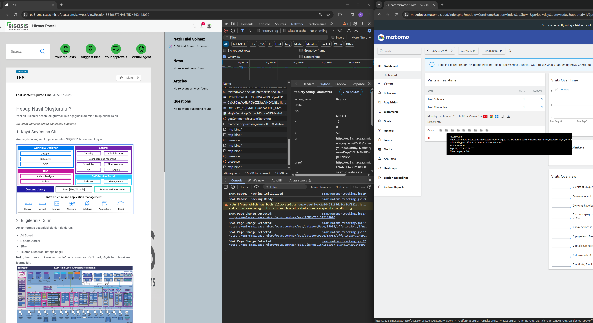

# SMAX Matomo Tracking Integration

**This project explains how to integrate SMAX Service Portal with Matomo to collect end-user analytics.**

A complete solution for integrating **Matomo Analytics** with **SMAX (Micro Focus Service Management Automation X) Service Portal** to track and analyze end-user behavior, page visits, navigation patterns, and service portal usage.

## 🎯 Overview

This project provides everything you need to integrate Matomo analytics with your SMAX Service Portal:

- **JavaScript tracking script** optimized for SMAX's Single Page Application (SPA) architecture
- **HTTPS servers** (Linux/Unix and Windows) to serve the tracking script with proper CORS headers
- **Step-by-step configuration guide** for both SMAX and Matomo
- **Real-time analytics** to understand how end users interact with your Service Portal

Collect valuable insights about your Service Portal users, including page views, navigation flows, session duration, and user engagement metrics.

## 📋 Features

- **SPA Navigation Tracking**: Automatically detects and tracks page changes in SMAX's single-page application
- **Multiple Detection Methods**: Uses polling, popstate, and hashchange listeners for comprehensive tracking
- **HTTPS Server**: Built-in Python HTTPS servers with CORS support
- **Cross-Platform**: Separate server implementations for Linux/Unix and Windows
- **Self-Signed Certificates**: Automatic SSL certificate generation for local development
- **Console Logging**: Debug mode for monitoring tracking events in real-time

## 🚀 Quick Start

### Prerequisites

- Python 3.x
- OpenSSL (must be installed and available in PATH)
- Matomo Analytics account

### Installation

1. Clone this repository:
```bash
git clone https://github.com/semihop/smax-matomo-tracking.git
cd smax-matomo-tracking
```

2. Start the HTTPS server:

**On Linux/Unix:**
```bash
python3 simple_https_server.py
```

**On Windows:**
```bash
python windows_https_server.py
```

The server will:
- Start on port `4443`
- Auto-generate SSL certificates (`server.crt` and `server.key`)
- Display the tracking script URL

3. Access the tracking script:
```
https://localhost:4443/smax-matomo-tracking.js
```

## 📦 What's Included

- **`smax-matomo-tracking.js`**: Main tracking script for SMAX
- **`simple_https_server.py`**: HTTPS server for Linux/Unix systems
- **`windows_https_server.py`**: HTTPS server for Windows systems
- **`server.crt` & `server.key`**: Auto-generated SSL certificates (not committed to repo)

## 🔧 Configuration

### Embedding in SMAX

1. Navigate to your SMAX Service Portal Settings
2. Go to **Configuration Settings** → **Embedded JavaScript**
3. Enable "Enable your own embedded JavaScript"
4. Add the tracking script in the **Embed code** field:

```html
<script src="https://your-server:4443/smax-matomo-tracking.js" type="text/javascript"></script>
```



### Matomo Setup

The script is pre-configured for Micro Focus Matomo Cloud:
- **Matomo URL**: `https://microfocus.matomo.cloud/`
- **Site ID**: `1`

To customize for your own Matomo instance, edit `smax-matomo-tracking.js`:

```javascript
var u="https://YOUR-MATOMO-URL/";
_paq.push(['setTrackerUrl', u+'matomo.php']);
_paq.push(['setSiteId', 'YOUR_SITE_ID']);
```



## 📊 Analytics Dashboard

Once configured, you'll see detailed visitor analytics in your Matomo dashboard:

### Visits Log


Track individual user sessions with detailed page navigation history, including:
- Page URLs and titles
- Navigation flow
- Session duration
- User actions

### Browser Developer Tools


Monitor tracking events in real-time through console logs:
- Page change detection
- URL tracking
- Navigation events

## 🛠️ How It Works

### Tracking Mechanisms

The script uses three complementary methods to detect SPA navigation:

1. **Interval Polling** (2-second intervals):
```javascript
setInterval(function() {
    if (location.href !== lastUrl || document.title !== lastTitle) {
        // Track page change
    }
}, 2000);
```

2. **Browser Navigation Events**:
```javascript
window.addEventListener('popstate', function() {
    // Track back/forward navigation
});
```

3. **Hash Changes**:
```javascript
window.addEventListener('hashchange', function() {
    // Track hash-based routing
});
```

### Server Architecture

Both server implementations provide:
- **CORS Headers**: `Access-Control-Allow-Origin: *` for cross-origin requests
- **Security Headers**: `X-Content-Type-Options`, `X-Frame-Options`
- **Content Type**: Proper `application/javascript` for `.js` files
- **Caching**: 1-hour cache for JavaScript files
- **SSL/TLS**: HTTPS support with auto-generated certificates

## 🔒 Security Notes

- The servers use **self-signed SSL certificates** for development purposes
- Browsers will show security warnings when accessing the tracking script
- For production use, replace with certificates from a trusted Certificate Authority
- CORS is configured to allow all origins (`*`) - restrict this in production environments

## 📝 Server Configuration

Both servers listen on port `4443` and auto-generate certificates on first run:

```python
PORT = 4443
CERT_FILE = "server.crt"
KEY_FILE = "server.key"
```

**Windows-specific features:**
- Enhanced OpenSSL detection with installation instructions
- Local IP address display for network access
- Better error handling with `subprocess` module

## 🐛 Debugging

Enable console logging to monitor tracking events:

```javascript
console.log('SMAX Matomo Tracking Initialized');
console.log('SMAX Page Change Detected:', location.href);
console.log('SMAX Navigation (popstate):', location.href);
```

Open your browser's Developer Tools (F12) to view these logs in real-time.

## 📄 License

This project is open source. Please check the repository for license details.

## 🤝 Contributing

Contributions are welcome! Please feel free to submit a Pull Request.

## 📧 Support

For issues and questions, please use the [GitHub Issues](https://github.com/semihop/smax-matomo-tracking/issues) page.

---

**Made with ❤️ for SMAX users**
